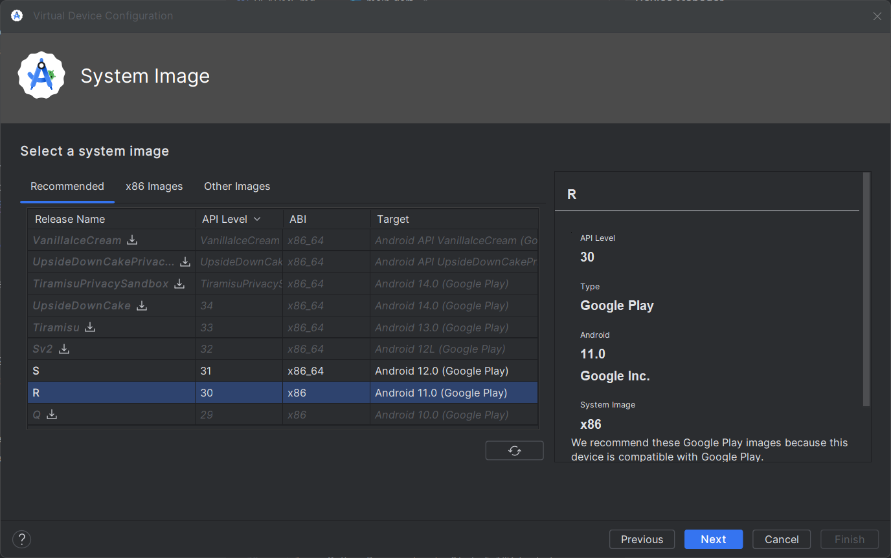

# five_seconds

## Getting Started

1. si la aplicacion se va a correr en emular porfavor revisar la version del api, en version 30 no funciona ISAR database o ABI x86 .
2. en caso de modificacion de modelos en el modulo de apps_tracked ejecutar el comando ""flutter pub run build_runner build"" para que ISAR pueda tomar las nuevas caracteristicas
3. se deben de aceptar todos los permisos para poder pasar a la pantalla principal.
4. la aplicacion utiliza el permiso de ""BIND_ACCESSIBILITY_SERVICE"" en caso de relese a google play, se nesesita llenar un formulario ya que es un permiso de trato especial.
5. actualmente en el modulo de appTracked, todos los cambios en la base de datos ISAR se escuchan en tiempo real, por lo cual al eliminar una app a trackear se puede notar una pequeña carga.

## Problemas no resueltos y principales retos.
como e comentado, no me fue posible terminar la aplicacion, ya que en flutter para saber y trackear otras apps, se debe de ahcer uso de codigo nativo Kotlin o Java, atraves de Method Channels, y asi poder escuchar eventos propios de ANDROID( eejemplo AccessibilityEvent.TYPE_WINDOW_STATE_CHANGED ),
habian otras formas de trackearlas indirectamente utilizando paquetes como Use_stats, los cuales te devolvia unas metricas de usos de la app, pero mi deseo de dominar los Method channels me hizo posponerlo.

al no haberme adentrado antes en funciones puristas de android no me habia topado con estos problemas, los cuales me llevaron a crear distintos proyectos, para mirar como configurar un background services o un method channel, en todos fracase, ya que no me daban el resultado esperado(supongo que era por estar tan crudo en el tema).

igualmente gente de everglow un placer participar en la seleccion de personal, y agradecido por abrirmen los ojos a un nuevo mundo de android de flutter.